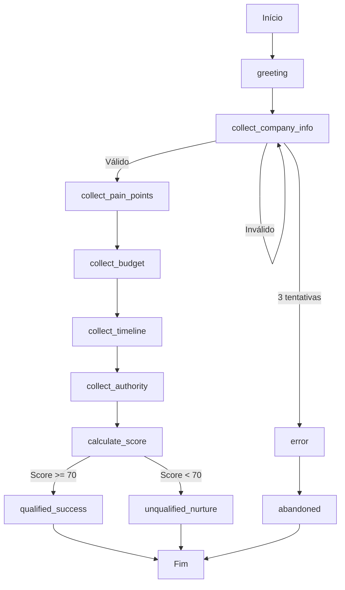

# Guia: Como Implementar Fluxos Conversacionais

## Visão Geral

Fluxos conversacionais são sequências estruturadas de interações que guiam o usuário através de um processo específico (qualificação de lead, resolução de problema, compra, etc). Este guia ensina como mapear, implementar e testar fluxos conversacionais efetivos.

## Índice

1. [Conceitos Fundamentais](#conceitos-fundamentais)
2. [Mapear Fluxo](#mapear-fluxo)
3. [Implementar State Machine](#implementar-state-machine)
4. [Coletar e Validar Dados](#coletar-e-validar-dados)
5. [Tratamento de Erros](#tratamento-de-erros)
6. [Implementar Fallback](#implementar-fallback)
7. [Testes](#testes)
8. [Exemplos Práticos](#exemplos-práticos)
9. [Troubleshooting](#troubleshooting)

## Conceitos Fundamentais

### O que é um Fluxo Conversacional?

Um fluxo é uma sequência de estados e transições que modela uma conversa estruturada:

```
Estado Inicial → Coleta Informação → Processa → Confirma → Estado Final
```

### Componentes de um Fluxo

1. **Estados**: Pontos específicos na conversa
2. **Transições**: Condições para mudar de estado
3. **Dados**: Informações coletadas
4. **Validações**: Regras de validação por estado
5. **Ações**: Operações executadas (API calls, cálculos)
6. **Fallbacks**: Comportamento quando algo falha

### Quando Usar Fluxos

**Use fluxos estruturados para**:
- Qualificação de leads (coleta sistemática de dados)
- Processos de compra (checkout)
- Agendamentos (data, hora, tipo)
- Troubleshooting guiado
- Onboarding de usuários

**Use conversa livre para**:
- Perguntas gerais
- Suporte não-estruturado
- Exploração de produtos

## Mapear Fluxo

### Passo 1: Identificar Objetivo

```markdown
# Exemplo: Fluxo de Qualificação de Lead

**Objetivo**: Coletar informações necessárias para qualificar um lead
e determinar se vale a pena alocar um vendedor humano.

**Resultado esperado**: Lead qualificado com score + dados salvos no CRM

**Gatilhos de entrada**:
- Usuário expressa interesse em compra
- Usuário pergunta sobre preços
- Usuário quer falar com vendedor
```

### Passo 2: Listar Estados

```python
# Estados do fluxo de qualificação
ESTADOS = {
    "greeting": "Saudação e contexto",
    "collect_company_info": "Coletar dados da empresa",
    "collect_pain_points": "Entender dores e necessidades",
    "collect_budget": "Entender orçamento disponível",
    "collect_timeline": "Entender urgência/timeline",
    "collect_authority": "Identificar poder de decisão",
    "calculate_score": "Calcular score de qualificação",
    "qualified_success": "Lead qualificado - próximos passos",
    "unqualified_nurture": "Lead não qualificado - nutrição",
    "error": "Erro no fluxo",
    "abandoned": "Usuário abandonou"
}
```

### Passo 3: Mapear Transições



### Passo 4: Documentar no Template

```bash
# Copiar e preencher template
cp templates/fluxos/template-fluxo.md docs/fluxos/qualificacao-lead.md
```

Ver: [Template de Fluxo](../../templates/fluxos/template-fluxo.md)

## Implementar State Machine

### Implementação Base

```python
# src/flows/lead_qualification_flow.py
"""
Fluxo de Qualificação de Lead

Este fluxo guia o usuário através de perguntas estratégicas para
coletar informações necessárias para qualificar o lead.
"""

from enum import Enum
from typing import Dict, Any, Optional, Tuple
from datetime import datetime
import logging


class FlowState(Enum):
    """Estados do fluxo"""
    GREETING = "greeting"
    COLLECT_COMPANY_INFO = "collect_company_info"
    COLLECT_PAIN_POINTS = "collect_pain_points"
    COLLECT_BUDGET = "collect_budget"
    COLLECT_TIMELINE = "collect_timeline"
    COLLECT_AUTHORITY = "collect_authority"
    CALCULATE_SCORE = "calculate_score"
    QUALIFIED_SUCCESS = "qualified_success"
    UNQUALIFIED_NURTURE = "unqualified_nurture"
    ERROR = "error"
    ABANDONED = "abandoned"


class LeadQualificationFlow:
    """
    Fluxo estruturado para qualificação de leads.

    Coleta informações através de perguntas direcionadas e calcula
    um score de qualificação baseado nas respostas.

    Attributes:
        agent: Agente de IA que processa as mensagens
        state: Estado atual do fluxo
        collected_data: Dados coletados durante o fluxo
        validation_attempts: Contador de tentativas de validação por campo
        max_validation_attempts: Máximo de tentativas antes de escalar
    """

    def __init__(self, agent, max_validation_attempts: int = 3):
        """
        Inicializa o fluxo.

        Args:
            agent: Instância do agente de IA
            max_validation_attempts: Máximo de tentativas de validação
        """
        self.agent = agent
        self.state = FlowState.GREETING
        self.collected_data = {}
        self.validation_attempts = {}
        self.max_validation_attempts = max_validation_attempts
        self.logger = logging.getLogger(__name__)

        # Histórico de estados (para debug e rollback)
        self.state_history = [FlowState.GREETING]

        self.logger.info("Lead qualification flow initialized")

    def process_message(
        self,
        user_message: str,
        context: Dict[str, Any]
    ) -> Dict[str, Any]:
        """
        Processa mensagem do usuário no contexto do fluxo atual.

        Args:
            user_message: Mensagem do usuário
            context: Contexto da conversa

        Returns:
            Dict com resposta, próximo estado e dados coletados
        """
        self.logger.info(f"Processing message in state: {self.state.value}")

        # Verificar comandos especiais
        if self._is_cancel_command(user_message):
            return self._handle_cancellation()

        # Processar baseado no estado atual
        if self.state == FlowState.GREETING:
            return self._handle_greeting(user_message, context)

        elif self.state == FlowState.COLLECT_COMPANY_INFO:
            return self._handle_collect_company_info(user_message, context)

        elif self.state == FlowState.COLLECT_PAIN_POINTS:
            return self._handle_collect_pain_points(user_message, context)

        elif self.state == FlowState.COLLECT_BUDGET:
            return self._handle_collect_budget(user_message, context)

        elif self.state == FlowState.COLLECT_TIMELINE:
            return self._handle_collect_timeline(user_message, context)

        elif self.state == FlowState.COLLECT_AUTHORITY:
            return self._handle_collect_authority(user_message, context)

        elif self.state == FlowState.CALCULATE_SCORE:
            return self._handle_calculate_score(user_message, context)

        elif self.state == FlowState.QUALIFIED_SUCCESS:
            return self._handle_qualified_success(user_message, context)

        elif self.state == FlowState.UNQUALIFIED_NURTURE:
            return self._handle_unqualified_nurture(user_message, context)

        else:
            # Estado desconhecido
            self.logger.error(f"Unknown state: {self.state}")
            return self._handle_error("Estado desconhecido")

    def _handle_greeting(
        self,
        user_message: str,
        context: Dict[str, Any]
    ) -> Dict[str, Any]:
        """
        Estado: GREETING

        Saudação inicial e explicação do processo.
        """
        response = f"""
        Olá! Sou {self.agent.config.get('agent_name', 'o assistente virtual')}.

        Vou fazer algumas perguntas para entender melhor suas necessidades
        e ver como podemos te ajudar. São apenas 5 perguntas rápidas, ok?

        Para começar: qual o nome da sua empresa?
        """

        # Transição para próximo estado
        self._transition_to(FlowState.COLLECT_COMPANY_INFO)

        return {
            "response": response.strip(),
            "state": self.state.value,
            "progress": "1/6",
            "collected_data": self.collected_data
        }

    def _handle_collect_company_info(
        self,
        user_message: str,
        context: Dict[str, Any]
    ) -> Dict[str, Any]:
        """
        Estado: COLLECT_COMPANY_INFO

        Coleta informações sobre a empresa.
        """
        # Extrair informações da mensagem
        company_info = self._extract_company_info(user_message, context)

        # Validar
        is_valid, error_message = self._validate_company_info(company_info)

        if not is_valid:
            # Incrementar contador de tentativas
            self.validation_attempts["company_info"] = \
                self.validation_attempts.get("company_info", 0) + 1

            # Verificar se excedeu tentativas
            if self.validation_attempts["company_info"] >= self.max_validation_attempts:
                return self._handle_error(
                    "Não consegui entender as informações da empresa. "
                    "Vou conectar você com um especialista."
                )

            # Solicitar novamente
            return {
                "response": f"{error_message}\n\nPode me contar novamente?",
                "state": self.state.value,
                "progress": "1/6",
                "validation_failed": True
            }

        # Armazenar dados
        self.collected_data.update(company_info)

        # Próximo estado
        self._transition_to(FlowState.COLLECT_PAIN_POINTS)

        response = f"""
        Ótimo, {company_info.get('company_name')}!

        Agora me conta: qual o principal desafio que vocês estão
        enfrentando hoje e que motivou você a buscar uma solução?
        """

        return {
            "response": response.strip(),
            "state": self.state.value,
            "progress": "2/6",
            "collected_data": self.collected_data
        }

    def _handle_collect_pain_points(
        self,
        user_message: str,
        context: Dict[str, Any]
    ) -> Dict[str, Any]:
        """
        Estado: COLLECT_PAIN_POINTS

        Identifica dores e necessidades.
        """
        # Extrair pain points usando o agente de IA
        pain_analysis = self._analyze_pain_points(user_message, context)

        self.collected_data["pain_points"] = pain_analysis["pain_points"]
        self.collected_data["urgency"] = pain_analysis["urgency"]

        # Próximo estado
        self._transition_to(FlowState.COLLECT_BUDGET)

        response = f"""
        Entendo, {pain_analysis['summary']}.

        Para te indicar a melhor solução, preciso entender o investimento
        disponível. Vocês têm um orçamento estimado para resolver isso?
        (Pode ser uma faixa, tipo "até R$ 2.000/mês")
        """

        return {
            "response": response.strip(),
            "state": self.state.value,
            "progress": "3/6",
            "collected_data": self.collected_data
        }

    def _handle_collect_budget(
        self,
        user_message: str,
        context: Dict[str, Any]
    ) -> Dict[str, Any]:
        """
        Estado: COLLECT_BUDGET

        Coleta informações sobre orçamento.
        """
        # Extrair valor do orçamento
        budget_info = self._extract_budget(user_message, context)

        # Validar
        is_valid, error_message = self._validate_budget(budget_info)

        if not is_valid:
            self.validation_attempts["budget"] = \
                self.validation_attempts.get("budget", 0) + 1

            if self.validation_attempts["budget"] >= self.max_validation_attempts:
                # Continuar sem budget (marca como 0 ou None)
                self.collected_data["budget"] = None
                self.collected_data["budget_note"] = "não informado após 3 tentativas"
            else:
                return {
                    "response": f"{error_message}\n\nPode me dar uma ideia de valor?",
                    "state": self.state.value,
                    "progress": "3/6",
                    "validation_failed": True
                }

        else:
            self.collected_data["budget"] = budget_info["budget"]
            self.collected_data["budget_range"] = budget_info.get("range")

        # Próximo estado
        self._transition_to(FlowState.COLLECT_TIMELINE)

        response = """
        Perfeito! E para quando vocês precisam dessa solução implementada?
        (ex: "urgente", "próximo mês", "próximo trimestre")
        """

        return {
            "response": response.strip(),
            "state": self.state.value,
            "progress": "4/6",
            "collected_data": self.collected_data
        }

    def _handle_collect_timeline(
        self,
        user_message: str,
        context: Dict[str, Any]
    ) -> Dict[str, Any]:
        """
        Estado: COLLECT_TIMELINE

        Coleta timeline/urgência.
        """
        timeline = self._extract_timeline(user_message, context)

        self.collected_data["timeline"] = timeline["timeline"]
        self.collected_data["urgency_score"] = timeline["urgency_score"]

        # Próximo estado
        self._transition_to(FlowState.COLLECT_AUTHORITY)

        response = """
        Ótimo! Última pergunta: qual sua posição na empresa?
        (ex: "sou o dono", "sou gerente de TI", "sou analista")
        """

        return {
            "response": response.strip(),
            "state": self.state.value,
            "progress": "5/6",
            "collected_data": self.collected_data
        }

    def _handle_collect_authority(
        self,
        user_message: str,
        context: Dict[str, Any]
    ) -> Dict[str, Any]:
        """
        Estado: COLLECT_AUTHORITY

        Identifica autoridade/poder de decisão.
        """
        authority = self._extract_authority(user_message, context)

        self.collected_data["role"] = authority["role"]
        self.collected_data["decision_power"] = authority["decision_power"]

        # Calcular score
        self._transition_to(FlowState.CALCULATE_SCORE)

        return self._handle_calculate_score(user_message, context)

    def _handle_calculate_score(
        self,
        user_message: str,
        context: Dict[str, Any]
    ) -> Dict[str, Any]:
        """
        Estado: CALCULATE_SCORE

        Calcula score de qualificação baseado nos dados coletados.
        """
        score = self._calculate_qualification_score()

        self.collected_data["qualification_score"] = score["total"]
        self.collected_data["qualification_breakdown"] = score["breakdown"]

        # Decidir próximo estado baseado no score
        if score["total"] >= 70:
            self._transition_to(FlowState.QUALIFIED_SUCCESS)
            return self._handle_qualified_success(user_message, context)
        else:
            self._transition_to(FlowState.UNQUALIFIED_NURTURE)
            return self._handle_unqualified_nurture(user_message, context)

    def _handle_qualified_success(
        self,
        user_message: str,
        context: Dict[str, Any]
    ) -> Dict[str, Any]:
        """
        Estado: QUALIFIED_SUCCESS

        Lead qualificado - definir próximos passos.
        """
        # Criar lead no CRM
        crm_result = self._create_crm_lead(self.collected_data)

        response = f"""
        Perfeito! Baseado no que você me contou, consigo ver como
        podemos te ajudar.

        Vou conectar você com {self.agent.config.get('sales_person_name', 'um especialista')}
        que vai te apresentar uma solução personalizada para:
        {self.collected_data.get('pain_points', '')}

        Você pode esperar um contato em até 2 horas úteis no email/telefone
        que você cadastrou. Enquanto isso, vou te enviar por email alguns
        materiais sobre como outras empresas resolveram desafios similares.

        Tem mais alguma dúvida que eu possa responder agora?
        """

        return {
            "response": response.strip(),
            "state": self.state.value,
            "progress": "6/6",
            "collected_data": self.collected_data,
            "qualification": "qualified",
            "crm_lead_id": crm_result.get("lead_id"),
            "flow_completed": True
        }

    def _handle_unqualified_nurture(
        self,
        user_message: str,
        context: Dict[str, Any]
    ) -> Dict[str, Any]:
        """
        Estado: UNQUALIFIED_NURTURE

        Lead não qualificado - estratégia de nutrição.
        """
        # Adicionar a lista de nutrição
        self._add_to_nurture_list(self.collected_data)

        response = f"""
        Obrigado por compartilhar essas informações!

        Baseado no que você me contou, vejo que no momento pode não ser
        o timing ideal para implementar uma solução.

        Mas não se preocupe! Vou te adicionar em nossa lista de conteúdos
        e você vai receber:
        - Dicas práticas sobre {self.collected_data.get('pain_points', 'gestão')}
        - Cases de sucesso
        - Novidades e promoções

        Quando for o momento certo, é só retomar a conversa!

        Posso te ajudar com mais alguma coisa?
        """

        return {
            "response": response.strip(),
            "state": self.state.value,
            "progress": "6/6",
            "collected_data": self.collected_data,
            "qualification": "unqualified",
            "flow_completed": True
        }

    # ========== MÉTODOS DE UTILIDADE ==========

    def _transition_to(self, new_state: FlowState):
        """
        Transiciona para novo estado.

        Args:
            new_state: Novo estado do fluxo
        """
        old_state = self.state
        self.state = new_state
        self.state_history.append(new_state)

        self.logger.info(f"State transition: {old_state.value} -> {new_state.value}")

    def _is_cancel_command(self, message: str) -> bool:
        """Verifica se mensagem é comando de cancelamento."""
        cancel_words = ["cancelar", "parar", "sair", "desistir", "não quero mais"]
        return any(word in message.lower() for word in cancel_words)

    def _handle_cancellation(self) -> Dict[str, Any]:
        """Trata cancelamento do fluxo."""
        self._transition_to(FlowState.ABANDONED)

        return {
            "response": "Sem problemas! Se mudar de ideia, é só me chamar. Até mais!",
            "state": self.state.value,
            "collected_data": self.collected_data,
            "flow_cancelled": True
        }

    def _handle_error(self, error_message: str) -> Dict[str, Any]:
        """Trata erro no fluxo."""
        self._transition_to(FlowState.ERROR)

        return {
            "response": f"""
            {error_message}

            Vou conectar você com um atendente humano que pode te ajudar melhor.
            """,
            "state": self.state.value,
            "collected_data": self.collected_data,
            "error": True,
            "escalate_to_human": True
        }

    def _extract_company_info(
        self,
        message: str,
        context: Dict[str, Any]
    ) -> Dict[str, Any]:
        """
        Extrai informações da empresa usando NLU.

        Args:
            message: Mensagem do usuário
            context: Contexto

        Returns:
            Dict com company_name, company_size, industry
        """
        # Usar agente de IA para extrair entidades
        prompt = f"""
        Extraia as seguintes informações desta mensagem:
        - company_name: Nome da empresa
        - company_size: Tamanho (pequena/média/grande ou número de funcionários)
        - industry: Setor/indústria (se mencionado)

        Mensagem: "{message}"

        Retorne em JSON format.
        """

        response = self.agent.llm.chat.completions.create(
            model="gpt-3.5-turbo",
            messages=[{"role": "user", "content": prompt}],
            response_format={"type": "json_object"}
        )

        import json
        return json.loads(response.choices[0].message.content)

    def _validate_company_info(
        self,
        company_info: Dict[str, Any]
    ) -> Tuple[bool, Optional[str]]:
        """
        Valida informações da empresa.

        Returns:
            Tuple (is_valid, error_message)
        """
        if not company_info.get("company_name"):
            return False, "Não consegui identificar o nome da empresa."

        if len(company_info["company_name"]) < 2:
            return False, "O nome da empresa parece muito curto."

        return True, None

    def _analyze_pain_points(
        self,
        message: str,
        context: Dict[str, Any]
    ) -> Dict[str, Any]:
        """
        Analisa pain points mencionados.

        Returns:
            Dict com pain_points, urgency, summary
        """
        prompt = f"""
        Analise os pain points/dores mencionados nesta mensagem:

        "{message}"

        Retorne:
        - pain_points: Lista de dores identificadas
        - urgency: nível de urgência (baixa/média/alta)
        - summary: Resumo em uma frase

        JSON format.
        """

        response = self.agent.llm.chat.completions.create(
            model="gpt-3.5-turbo",
            messages=[{"role": "user", "content": prompt}],
            response_format={"type": "json_object"}
        )

        import json
        return json.loads(response.choices[0].message.content)

    def _extract_budget(
        self,
        message: str,
        context: Dict[str, Any]
    ) -> Dict[str, Any]:
        """
        Extrai informação de orçamento.

        Returns:
            Dict com budget (float), range (str)
        """
        import re

        # Padrões para valores
        patterns = [
            r'R\$\s*(\d+[\.,]?\d*)',  # R$ 1000 ou R$ 1.000
            r'(\d+[\.,]?\d*)\s*reais',  # 1000 reais
            r'(\d+[\.,]?\d*)k',  # 10k
        ]

        for pattern in patterns:
            match = re.search(pattern, message, re.IGNORECASE)
            if match:
                value_str = match.group(1).replace(',', '.')
                value = float(value_str)

                # Se termina em k, multiplicar por 1000
                if 'k' in message.lower():
                    value *= 1000

                return {
                    "budget": value,
                    "range": self._budget_to_range(value)
                }

        # Não encontrou valor numérico, tentar extrair faixa
        if "até" in message.lower():
            return {"budget": 0, "range": "indefinido", "note": message}

        return {"budget": None, "range": None}

    def _validate_budget(
        self,
        budget_info: Dict[str, Any]
    ) -> Tuple[bool, Optional[str]]:
        """Valida informação de orçamento."""
        if budget_info.get("budget") is None:
            return False, "Não consegui identificar um valor de orçamento."

        if budget_info["budget"] < 0:
            return False, "O valor precisa ser positivo."

        return True, None

    def _budget_to_range(self, value: float) -> str:
        """Converte valor para faixa."""
        if value < 1000:
            return "< R$ 1.000"
        elif value < 3000:
            return "R$ 1.000 - R$ 3.000"
        elif value < 5000:
            return "R$ 3.000 - R$ 5.000"
        elif value < 10000:
            return "R$ 5.000 - R$ 10.000"
        else:
            return "> R$ 10.000"

    def _extract_timeline(
        self,
        message: str,
        context: Dict[str, Any]
    ) -> Dict[str, Any]:
        """
        Extrai timeline/urgência.

        Returns:
            Dict com timeline (str), urgency_score (int)
        """
        urgency_keywords = {
            "imediato": 100,
            "urgente": 100,
            "hoje": 100,
            "essa semana": 90,
            "este mês": 80,
            "próximo mês": 70,
            "30 dias": 70,
            "próximo trimestre": 50,
            "3 meses": 50,
            "próximo ano": 30,
            "ano que vem": 30,
            "ainda não sei": 20
        }

        message_lower = message.lower()
        matched_urgency = 50  # Default

        for keyword, score in urgency_keywords.items():
            if keyword in message_lower:
                matched_urgency = score
                break

        return {
            "timeline": message,
            "urgency_score": matched_urgency
        }

    def _extract_authority(
        self,
        message: str,
        context: Dict[str, Any]
    ) -> Dict[str, Any]:
        """
        Extrai cargo/autoridade.

        Returns:
            Dict com role (str), decision_power (int)
        """
        decision_power = {
            "dono": 100,
            "ceo": 100,
            "diretor": 90,
            "sócio": 90,
            "gerente": 70,
            "coordenador": 60,
            "supervisor": 50,
            "analista": 30,
            "assistente": 20,
            "estagiário": 10
        }

        message_lower = message.lower()
        matched_power = 50  # Default

        for role, power in decision_power.items():
            if role in message_lower:
                matched_power = power
                break

        return {
            "role": message,
            "decision_power": matched_power
        }

    def _calculate_qualification_score(self) -> Dict[str, Any]:
        """
        Calcula score de qualificação (0-100).

        Critérios:
        - Budget: 40 pontos
        - Timeline/Urgência: 30 pontos
        - Autoridade: 30 pontos

        Returns:
            Dict com total e breakdown
        """
        budget = self.collected_data.get("budget", 0) or 0
        urgency = self.collected_data.get("urgency_score", 50)
        authority = self.collected_data.get("decision_power", 50)

        # Budget score (0-40)
        if budget >= 5000:
            budget_score = 40
        elif budget >= 2000:
            budget_score = 30
        elif budget >= 1000:
            budget_score = 20
        elif budget > 0:
            budget_score = 10
        else:
            budget_score = 0

        # Urgency score (0-30)
        urgency_score = int(urgency * 0.3)

        # Authority score (0-30)
        authority_score = int(authority * 0.3)

        total = budget_score + urgency_score + authority_score

        return {
            "total": total,
            "breakdown": {
                "budget": budget_score,
                "urgency": urgency_score,
                "authority": authority_score
            }
        }

    def _create_crm_lead(self, data: Dict[str, Any]) -> Dict[str, Any]:
        """
        Cria lead no CRM.

        Args:
            data: Dados coletados

        Returns:
            Dict com lead_id e status
        """
        try:
            # Integração com CRM (implementar conforme seu CRM)
            from integrations.crm import create_lead

            lead_data = {
                "company_name": data.get("company_name"),
                "company_size": data.get("company_size"),
                "pain_points": data.get("pain_points"),
                "budget": data.get("budget"),
                "timeline": data.get("timeline"),
                "role": data.get("role"),
                "qualification_score": data.get("qualification_score"),
                "source": "chatbot_qualification_flow"
            }

            result = create_lead(lead_data)
            self.logger.info(f"CRM lead created: {result.get('lead_id')}")

            return result

        except Exception as e:
            self.logger.error(f"Error creating CRM lead: {e}")
            return {"success": False, "error": str(e)}

    def _add_to_nurture_list(self, data: Dict[str, Any]):
        """Adiciona lead à lista de nutrição."""
        try:
            from integrations.marketing import add_to_nurture

            add_to_nurture({
                "company_name": data.get("company_name"),
                "pain_points": data.get("pain_points"),
                "reason": "not_qualified",
                "score": data.get("qualification_score")
            })

            self.logger.info("Added to nurture list")

        except Exception as e:
            self.logger.error(f"Error adding to nurture: {e}")

    def get_progress(self) -> Dict[str, Any]:
        """
        Retorna progresso atual do fluxo.

        Returns:
            Dict com estado, progresso, dados coletados
        """
        total_steps = 6
        current_step = len([s for s in self.state_history if s != FlowState.GREETING])

        return {
            "current_state": self.state.value,
            "current_step": min(current_step, total_steps),
            "total_steps": total_steps,
            "progress_percent": int((current_step / total_steps) * 100),
            "collected_data": self.collected_data,
            "state_history": [s.value for s in self.state_history]
        }

    def reset(self):
        """Reseta o fluxo para o estado inicial."""
        self.state = FlowState.GREETING
        self.collected_data = {}
        self.validation_attempts = {}
        self.state_history = [FlowState.GREETING]
        self.logger.info("Flow reset to initial state")
```

## Coletar e Validar Dados

### Estratégias de Extração

```python
# 1. Regex simples para dados estruturados
def extract_phone(text: str) -> Optional[str]:
    """Extrai telefone."""
    import re
    patterns = [
        r'\(?\d{2}\)?[\s-]?\d{4,5}[\s-]?\d{4}',  # (11) 99999-9999
        r'\d{10,11}'  # 11999999999
    ]

    for pattern in patterns:
        match = re.search(pattern, text)
        if match:
            return match.group(0)

    return None


# 2. LLM para extração complexa
def extract_with_llm(text: str, schema: Dict) -> Dict:
    """
    Usa LLM para extrair dados estruturados.

    Args:
        text: Texto do usuário
        schema: Schema dos dados esperados

    Returns:
        Dados extraídos
    """
    prompt = f"""
    Extraia as seguintes informações do texto:

    Schema esperado:
    {json.dumps(schema, indent=2)}

    Texto:
    "{text}"

    Retorne JSON com os campos do schema. Se não encontrar, use null.
    """

    response = llm.chat.completions.create(
        model="gpt-3.5-turbo",
        messages=[{"role": "user", "content": prompt}],
        response_format={"type": "json_object"}
    )

    return json.loads(response.choices[0].message.content)


# 3. Validação robusta
def validate_field(
    field_name: str,
    value: Any,
    rules: Dict[str, Any]
) -> Tuple[bool, Optional[str]]:
    """
    Valida campo baseado em regras.

    Args:
        field_name: Nome do campo
        value: Valor a validar
        rules: Regras de validação

    Returns:
        Tuple (is_valid, error_message)
    """
    # Requerido
    if rules.get("required") and not value:
        return False, f"{field_name} é obrigatório"

    # Tipo
    expected_type = rules.get("type")
    if expected_type and not isinstance(value, expected_type):
        return False, f"{field_name} deve ser {expected_type.__name__}"

    # Min/Max para números
    if isinstance(value, (int, float)):
        if "min" in rules and value < rules["min"]:
            return False, f"{field_name} deve ser >= {rules['min']}"
        if "max" in rules and value > rules["max"]:
            return False, f"{field_name} deve ser <= {rules['max']}"

    # Min/Max length para strings
    if isinstance(value, str):
        if "min_length" in rules and len(value) < rules["min_length"]:
            return False, f"{field_name} deve ter pelo menos {rules['min_length']} caracteres"
        if "max_length" in rules and len(value) > rules["max_length"]:
            return False, f"{field_name} deve ter no máximo {rules['max_length']} caracteres"

    # Pattern (regex)
    if "pattern" in rules:
        import re
        if not re.match(rules["pattern"], str(value)):
            return False, f"{field_name} está em formato inválido"

    # Custom validator
    if "validator" in rules:
        validator_fn = rules["validator"]
        is_valid, error = validator_fn(value)
        if not is_valid:
            return False, error

    return True, None
```

## Tratamento de Erros

### Tipos de Erros

```python
class FlowError(Exception):
    """Base class para erros de fluxo"""
    pass


class ValidationError(FlowError):
    """Erro de validação de dados"""
    pass


class IntegrationError(FlowError):
    """Erro de integração externa"""
    pass


class TimeoutError(FlowError):
    """Timeout no fluxo"""
    pass


# Tratamento específico por tipo
def handle_flow_error(error: Exception, state: FlowState) -> Dict[str, Any]:
    """
    Trata erros baseado no tipo.

    Args:
        error: Exceção capturada
        state: Estado atual do fluxo

    Returns:
        Resposta apropriada para o erro
    """
    if isinstance(error, ValidationError):
        return {
            "response": "Ops, não consegui entender. Pode reformular?",
            "error_type": "validation",
            "retry": True
        }

    elif isinstance(error, IntegrationError):
        return {
            "response": """
            Desculpe, estou com dificuldade para acessar alguns dados.
            Vou te conectar com um atendente humano.
            """,
            "error_type": "integration",
            "escalate": True
        }

    elif isinstance(error, TimeoutError):
        return {
            "response": """
            Percebi que você ficou um tempo sem responder.
            Quer continuar de onde paramos ou preferir começar de novo?
            """,
            "error_type": "timeout",
            "options": ["continuar", "reiniciar"]
        }

    else:
        # Erro desconhecido
        logger.error(f"Unhandled error in state {state}: {error}")
        return {
            "response": """
            Desculpe, algo deu errado. Vou te conectar com suporte.
            """,
            "error_type": "unknown",
            "escalate": True
        }
```

## Implementar Fallback

```python
class FlowFallbackHandler:
    """Gerencia fallbacks do fluxo"""

    def __init__(self, flow, max_retries: int = 2):
        self.flow = flow
        self.max_retries = max_retries
        self.retry_count = {}

    def handle_validation_failure(
        self,
        field_name: str,
        attempted_value: Any,
        error_message: str
    ) -> Dict[str, Any]:
        """
        Trata falha de validação com retry e fallback.

        Returns:
            Resposta com estratégia de recuperação
        """
        # Incrementar contador
        self.retry_count[field_name] = self.retry_count.get(field_name, 0) + 1

        # Se excedeu tentativas, escalar
        if self.retry_count[field_name] > self.max_retries:
            return {
                "response": f"""
                Tive dificuldade com {field_name}.
                Vou conectar você com alguém que pode ajudar melhor.
                """,
                "action": "escalate_to_human",
                "reason": f"validation_failed_{field_name}"
            }

        # Fornecer exemplos
        examples = self._get_examples_for_field(field_name)

        return {
            "response": f"""
            {error_message}

            Exemplos: {', '.join(examples)}

            Pode tentar novamente?
            """,
            "action": "retry",
            "retry_count": self.retry_count[field_name]
        }

    def handle_stuck_state(self, state: FlowState) -> Dict[str, Any]:
        """
        Trata situação onde fluxo está travado em um estado.

        Returns:
            Estratégia de recuperação
        """
        # Oferecer opções
        return {
            "response": """
            Vejo que estamos travados aqui. O que você prefere?

            1. Pular esta etapa
            2. Falar com atendente humano
            3. Recomeçar do início
            """,
            "action": "offer_options",
            "options": ["skip", "escalate", "restart"]
        }

    def handle_unexpected_input(
        self,
        input: str,
        expected: str
    ) -> Dict[str, Any]:
        """
        Trata input inesperado.

        Args:
            input: Input recebido
            expected: O que era esperado

        Returns:
            Resposta de redirecionamento
        """
        return {
            "response": f"""
            Acho que você está perguntando sobre {self._classify_intent(input)}.

            Mas antes de ir para isso, preciso terminar de coletar:
            {expected}

            Podemos continuar com isso? Depois te ajudo com sua pergunta!
            """,
            "action": "redirect",
            "redirect_to": "continue_flow"
        }

    def _get_examples_for_field(self, field_name: str) -> List[str]:
        """Retorna exemplos para um campo."""
        examples_map = {
            "company_name": ["Empresa XPTO", "Acme Corp", "Minha Loja"],
            "budget": ["R$ 2.000", "até 5 mil", "entre 3k e 10k"],
            "timeline": ["urgente", "próximo mês", "em 30 dias"],
            "phone": ["(11) 99999-9999", "11999999999"]
        }

        return examples_map.get(field_name, ["exemplo 1", "exemplo 2"])

    def _classify_intent(self, input: str) -> str:
        """Classifica intenção do input inesperado."""
        # Implementar classificação simples ou usar LLM
        intents = {
            "preço": ["quanto custa", "preço", "valor"],
            "funcionalidade": ["funciona", "faz", "tem"],
            "suporte": ["ajuda", "problema", "erro"]
        }

        input_lower = input.lower()

        for intent, keywords in intents.items():
            if any(keyword in input_lower for keyword in keywords):
                return intent

        return "outro assunto"
```

## Testes

Ver também: [Testes de Conversação](testes-conversacao.md)

```python
# tests/unit/test_lead_qualification_flow.py
import pytest
from flows.lead_qualification_flow import LeadQualificationFlow, FlowState
from unittest.mock import Mock


@pytest.fixture
def flow():
    """Fixture do fluxo"""
    mock_agent = Mock()
    mock_agent.config = {"agent_name": "TestBot"}
    mock_agent.llm = Mock()

    return LeadQualificationFlow(mock_agent)


def test_flow_initialization(flow):
    """Testa inicialização"""
    assert flow.state == FlowState.GREETING
    assert flow.collected_data == {}
    assert len(flow.state_history) == 1


def test_greeting_transition(flow):
    """Testa transição de greeting"""
    result = flow.process_message("Olá", {})

    assert result["state"] == FlowState.COLLECT_COMPANY_INFO.value
    assert "nome da sua empresa" in result["response"].lower()
    assert result["progress"] == "1/6"


def test_full_happy_path(flow):
    """Testa fluxo completo feliz"""
    # Mock LLM responses
    flow.agent.llm.chat.completions.create.return_value = Mock(
        choices=[Mock(message=Mock(content='{"company_name": "Test Corp", "company_size": "50"}'))]
    )

    # 1. Greeting
    r1 = flow.process_message("Olá", {})
    assert r1["state"] == FlowState.COLLECT_COMPANY_INFO.value

    # 2. Company info
    r2 = flow.process_message("Minha empresa é Test Corp, temos 50 funcionários", {})
    assert r2["state"] == FlowState.COLLECT_PAIN_POINTS.value
    assert "Test Corp" in flow.collected_data.get("company_name", "")

    # 3. Pain points
    flow.agent.llm.chat.completions.create.return_value = Mock(
        choices=[Mock(message=Mock(content='{"pain_points": ["gestão"], "urgency": "alta", "summary": "problemas com gestão"}'))]
    )
    r3 = flow.process_message("Temos problemas com gestão de vendas", {})
    assert r3["state"] == FlowState.COLLECT_BUDGET.value

    # 4. Budget
    r4 = flow.process_message("Temos R$ 3.000 por mês", {})
    assert r4["state"] == FlowState.COLLECT_TIMELINE.value
    assert flow.collected_data.get("budget") == 3000

    # 5. Timeline
    r5 = flow.process_message("Precisamos urgente", {})
    assert r5["state"] == FlowState.COLLECT_AUTHORITY.value

    # 6. Authority -> Score -> Result
    r6 = flow.process_message("Sou o CEO", {})
    assert flow.collected_data.get("decision_power") == 100
    assert "qualification_score" in flow.collected_data

    # Verificar qualificação
    if flow.collected_data["qualification_score"] >= 70:
        assert r6["qualification"] == "qualified"
    else:
        assert r6["qualification"] == "unqualified"


def test_validation_retry(flow):
    """Testa retry de validação"""
    # Mock que sempre retorna vazio
    flow.agent.llm.chat.completions.create.return_value = Mock(
        choices=[Mock(message=Mock(content='{}'))]
    )

    # Tentar coletar company info
    flow.state = FlowState.COLLECT_COMPANY_INFO

    # Primeira tentativa
    r1 = flow.process_message("abc", {})
    assert r1.get("validation_failed") is True
    assert flow.validation_attempts.get("company_info") == 1

    # Segunda tentativa
    r2 = flow.process_message("xyz", {})
    assert flow.validation_attempts.get("company_info") == 2

    # Terceira tentativa - deve escalar
    r3 = flow.process_message("123", {})
    assert r3.get("escalate_to_human") is True or r3.get("error") is True


def test_cancellation(flow):
    """Testa cancelamento"""
    result = flow.process_message("cancelar", {})

    assert result["state"] == FlowState.ABANDONED.value
    assert result.get("flow_cancelled") is True


def test_progress_tracking(flow):
    """Testa tracking de progresso"""
    progress = flow.get_progress()

    assert progress["current_state"] == FlowState.GREETING.value
    assert progress["current_step"] <= progress["total_steps"]
    assert 0 <= progress["progress_percent"] <= 100
```

## Exemplos Práticos

### Exemplo 1: Fluxo de Agendamento

```python
class SchedulingFlow:
    """Fluxo para agendar reuniões/demos"""

    def _handle_collect_date(self, message, context):
        """Coleta data desejada"""
        date = self._extract_date(message)

        if not date:
            return {
                "response": "Não consegui identificar a data. Tente: 'amanhã', 'próxima segunda', ou '15/02'",
                "validation_failed": True
            }

        # Verificar se data está disponível
        available_slots = self._check_availability(date)

        if not available_slots:
            return {
                "response": f"Infelizmente {date} não tem horários disponíveis. Que tal {self._suggest_alternative()}?",
                "validation_failed": True
            }

        self.collected_data["date"] = date
        self.collected_data["available_slots"] = available_slots

        self._transition_to(FlowState.COLLECT_TIME)

        return {
            "response": f"""
            Perfeito! Para {date} tenho os seguintes horários:
            {self._format_slots(available_slots)}

            Qual funciona melhor para você?
            """,
            "state": self.state.value
        }
```

### Exemplo 2: Fluxo de Troubleshooting

```python
class TroubleshootingFlow:
    """Fluxo guiado para resolver problemas"""

    def _handle_identify_problem(self, message, context):
        """Identifica tipo de problema"""
        problem_type = self._classify_problem(message)

        # Buscar solução no knowledge base
        solutions = self._search_solutions(problem_type)

        if solutions:
            # Tentar solução automática
            self._transition_to(FlowState.TRY_SOLUTION)

            return {
                "response": f"""
                Entendo, parece ser um problema de {problem_type}.

                Vamos tentar o seguinte:
                {solutions[0]["steps"]}

                Funcionou?
                """,
                "state": self.state.value,
                "solution_id": solutions[0]["id"]
            }
        else:
            # Não tem solução automática, escalar
            return self._escalate_to_support(problem_type, message)
```

## Troubleshooting

### Problema: Fluxo pula estados

**Causa**: Lógica de transição incorreta

**Solução**:
```python
# Sempre use método _transition_to
def _transition_to(self, new_state):
    """Transição controlada com log"""
    self.logger.info(f"Transition: {self.state} -> {new_state}")
    self.state = new_state
    self.state_history.append(new_state)

    # Validar transição
    if not self._is_valid_transition(self.state_history[-2], new_state):
        self.logger.error(f"Invalid transition detected!")
        # Reverter ou tratar
```

### Problema: Dados não sendo coletados

**Causa**: Erro na extração ou validação falhando silenciosamente

**Solução**:
```python
# Log detalhado
def _extract_data(self, message, field):
    try:
        extracted = self._extract_fn(message)
        self.logger.debug(f"Extracted {field}: {extracted}")

        is_valid, error = self._validate(extracted)
        self.logger.debug(f"Validation {field}: valid={is_valid}, error={error}")

        if is_valid:
            self.collected_data[field] = extracted
            self.logger.info(f"Collected {field}: {extracted}")
        else:
            self.logger.warning(f"Validation failed for {field}: {error}")

        return is_valid, error

    except Exception as e:
        self.logger.error(f"Error extracting {field}: {e}")
        return False, str(e)
```

### Problema: Usuário não segue fluxo

**Causa**: Input fora do esperado

**Solução**:
```python
def process_message(self, message, context):
    # Verificar se mensagem é tangencial
    if self._is_off_topic(message, self.state):
        return self._handle_off_topic(message)

    # Processar normalmente
    return self._process_by_state(message, context)


def _handle_off_topic(self, message):
    """Trata mensagens fora do tópico"""
    # Classificar intenção
    intent = self._classify_intent(message)

    if intent == "question":
        # Responder brevemente e voltar ao fluxo
        answer = self._quick_answer(message)
        return {
            "response": f"{answer}\n\nVoltando: {self._get_current_question()}",
            "state": self.state.value
        }

    elif intent == "cancellation":
        return self._handle_cancellation()

    else:
        return {
            "response": "Interessante! Mas vamos terminar isso primeiro, depois te ajudo com isso. Ok?",
            "state": self.state.value
        }
```

## Próximos Passos

- [Testes de Conversação](testes-conversacao.md): Como testar fluxos
- [Criar Agente](criar-agente.md): Integrar fluxos com agentes
- [Integrações](integracao-apis.md): Conectar com APIs externas
- [Processo 03](../processos/03-desenvolvimento.md): Desenvolvimento completo

## Referências

- [Template de Fluxo](../../templates/fluxos/template-fluxo.md)
- [Exemplos de Fluxos](../../examples/fluxos/)
- [State Machine Pattern](https://en.wikipedia.org/wiki/Finite-state_machine)
