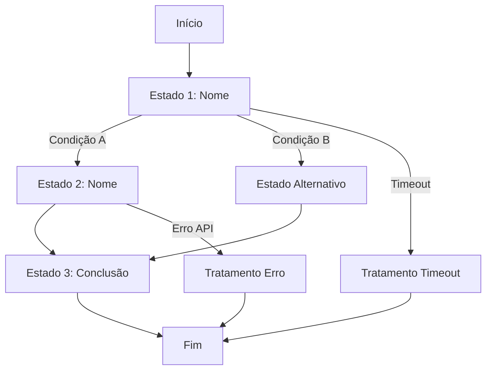

# Template de Fluxo Conversacional

## Informações do Fluxo

- **Nome**: [NOME_DO_FLUXO]
- **ID**: [ID_UNICO]
- **Versão**: 1.0
- **Data**: [DATA]
- **Autor**: [NOME]
- **Objetivo**: [DESCREVER OBJETIVO DO FLUXO]

## Gatilhos de Entrada

Este fluxo é ativado quando:
- [ ] [CONDIÇÃO 1 - ex: Usuário expressa intenção de compra]
- [ ] [CONDIÇÃO 2 - ex: Usuário pergunta sobre preço]
- [ ] [CONDIÇÃO 3]

**Intenções relacionadas**:
- `[intent_name_1]`
- `[intent_name_2]`
- `[intent_name_3]`

## Estados do Fluxo

### Estado 1: [NOME_ESTADO]

**Objetivo**: [O que este estado faz]

**Mensagem ao Usuário**:
```
[MENSAGEM QUE O AGENTE ENVIA]
```

**Informações a Coletar**:
- `[campo1]`: [descrição] - [tipo: texto/número/data/etc]
- `[campo2]`: [descrição] - [tipo]

**Validações**:
```python
def validar_estado1(input_usuario):
    # [LÓGICA DE VALIDAÇÃO]
    if not valido:
        return False, "[MENSAGEM DE ERRO]"
    return True, None
```

**Transições**:
- Se `[CONDIÇÃO]` → [ESTADO_DESTINO]
- Se `[CONDIÇÃO]` → [ESTADO_DESTINO]
- Timeout (Xs) → [ESTADO_TIMEOUT]

---

### Estado 2: [NOME_ESTADO]

**Objetivo**: [O que este estado faz]

**Mensagem ao Usuário**:
```
[MENSAGEM QUE O AGENTE ENVIA]
```

**Ações**:
- [ ] [AÇÃO 1 - ex: Consultar API de produtos]
- [ ] [AÇÃO 2 - ex: Calcular preço]
- [ ] [AÇÃO 3]

**Transições**:
- Se `[CONDIÇÃO]` → [ESTADO_DESTINO]
- Se erro na API → [ESTADO_ERRO]

---

### Estado 3: [NOME_ESTADO_FINAL]

**Objetivo**: Finalizar fluxo com sucesso

**Mensagem ao Usuário**:
```
[MENSAGEM DE CONCLUSÃO]
```

**Ações de Finalização**:
- [ ] [SALVAR DADOS]
- [ ] [ENVIAR NOTIFICAÇÃO]
- [ ] [REGISTRAR MÉTRICA]

**Próximos Passos**:
- [O QUE ACONTECE APÓS CONCLUSÃO]

## Diagrama do Fluxo



## Contexto Necessário

Informações que devem estar disponíveis no contexto:

```python
contexto_necessario = {
    "user_id": str,           # ID do usuário
    "session_id": str,        # ID da sessão
    "channel": str,           # Canal (whatsapp, web, etc)
    "user_profile": dict,     # Perfil do usuário
    "[campo_custom]": type,   # Outros campos necessários
}
```

## Dados Coletados

Dados que este fluxo coleta ao final:

```python
dados_coletados = {
    "[campo1]": {
        "type": "string",
        "required": True,
        "description": "[descrição]"
    },
    "[campo2]": {
        "type": "number",
        "required": False,
        "description": "[descrição]",
        "default": 0
    },
    # ... outros campos
}
```

## Integrações

APIs ou serviços utilizados neste fluxo:

### Integração 1: [NOME_SERVICO]
- **Endpoint**: `[URL/PATH]`
- **Método**: `[GET/POST/etc]`
- **Quando chamar**: [CONDIÇÃO]
- **Tratamento de erro**: [ESTRATÉGIA]

### Integração 2: [NOME_SERVICO]
- **Endpoint**: `[URL/PATH]`
- **Método**: `[GET/POST/etc]`
- **Quando chamar**: [CONDIÇÃO]
- **Tratamento de erro**: [ESTRATÉGIA]

## Tratamento de Erros

### Erro 1: [TIPO_ERRO]
**Quando ocorre**: [SITUAÇÃO]
**Ação**: [O QUE FAZER]
**Mensagem ao usuário**:
```
[MENSAGEM]
```

### Erro 2: Timeout
**Quando ocorre**: Usuário não responde em [X] segundos
**Ação**: [ENVIAR LEMBRETE / ABANDONAR / etc]
**Mensagem ao usuário**:
```
[MENSAGEM]
```

### Erro 3: Validação Falhou
**Quando ocorre**: Input do usuário inválido
**Ação**: Solicitar novamente (máx [N] tentativas)
**Mensagem ao usuário**:
```
[MENSAGEM]
```

## Estratégias de Fallback

Se o fluxo não conseguir prosseguir:

1. **Primeira tentativa**: [AÇÃO]
2. **Segunda tentativa**: [AÇÃO]
3. **Terceira tentativa**: [ESCALAR PARA HUMANO / ABANDONAR]

**Mensagem de escalação**:
```
[MENSAGEM AO TRANSFERIR PARA HUMANO]
```

## Condições de Saída

Este fluxo pode ser interrompido quando:

- [ ] Usuário solicita explicitamente (ex: "cancelar", "parar")
- [ ] [NÚMERO] tentativas falhas de validação
- [ ] Timeout global de [X] minutos
- [ ] [OUTRA CONDIÇÃO]

**Ações ao sair**:
- [ ] Salvar estado parcial
- [ ] Registrar motivo da saída
- [ ] Enviar pesquisa de satisfação (se aplicável)

## Variações

### Variação 1: [CENÁRIO]
Quando: [CONDIÇÃO]
Mudanças no fluxo:
- [MUDANÇA 1]
- [MUDANÇA 2]

### Variação 2: [CENÁRIO]
Quando: [CONDIÇÃO]
Mudanças no fluxo:
- [MUDANÇA 1]
- [MUDANÇA 2]

## Métricas

Métricas importantes para este fluxo:

- **Taxa de conclusão**: % de usuários que completam
- **Tempo médio**: Tempo para completar fluxo
- **Drop-off rate**: % de abandono por estado
- **Taxa de erro**: % de erros por tipo
- **[MÉTRICA CUSTOM]**: [DESCRIÇÃO]

**Targets**:
- Taxa de conclusão: >= [X]%
- Tempo médio: <= [X] minutos
- Drop-off: <= [X]%

## Exemplos de Conversação

### Exemplo 1: Happy Path

```
User: [MENSAGEM INICIAL]
Agent: [RESPOSTA - Estado 1]

User: [RESPOSTA]
Agent: [RESPOSTA - Estado 2]

User: [RESPOSTA]
Agent: [RESPOSTA - Estado 3/Conclusão]
```

### Exemplo 2: Com Correção

```
User: [MENSAGEM INICIAL]
Agent: [RESPOSTA - Estado 1]

User: [RESPOSTA INVÁLIDA]
Agent: [MENSAGEM DE ERRO + NOVA SOLICITAÇÃO]

User: [RESPOSTA CORRIGIDA]
Agent: [RESPOSTA - Estado 2]
...
```

### Exemplo 3: Interrupção

```
User: [MENSAGEM INICIAL]
Agent: [RESPOSTA - Estado 1]

User: "cancelar"
Agent: [MENSAGEM DE CANCELAMENTO]
```

## Notas de Implementação

- [NOTA 1 SOBRE IMPLEMENTAÇÃO]
- [NOTA 2 SOBRE CONSIDERAÇÕES TÉCNICAS]
- [NOTA 3 SOBRE EDGE CASES]

## Testes

### Caso de Teste 1: Happy Path
**Setup**: [PRÉ-CONDIÇÕES]
**Steps**: [PASSOS]
**Expected**: [RESULTADO ESPERADO]

### Caso de Teste 2: Validação Falha
**Setup**: [PRÉ-CONDIÇÕES]
**Steps**: [PASSOS]
**Expected**: [RESULTADO ESPERADO]

### Caso de Teste 3: Erro de Integração
**Setup**: [PRÉ-CONDIÇÕES]
**Steps**: [PASSOS]
**Expected**: [RESULTADO ESPERADO]

## Histórico de Versões

### v1.0 - [DATA]
- Versão inicial do fluxo
- [DESCRIÇÃO DAS FUNCIONALIDADES]

### v1.1 - [DATA]
- [MUDANÇA 1]
- [MUDANÇA 2]
- [MOTIVO DAS MUDANÇAS]
