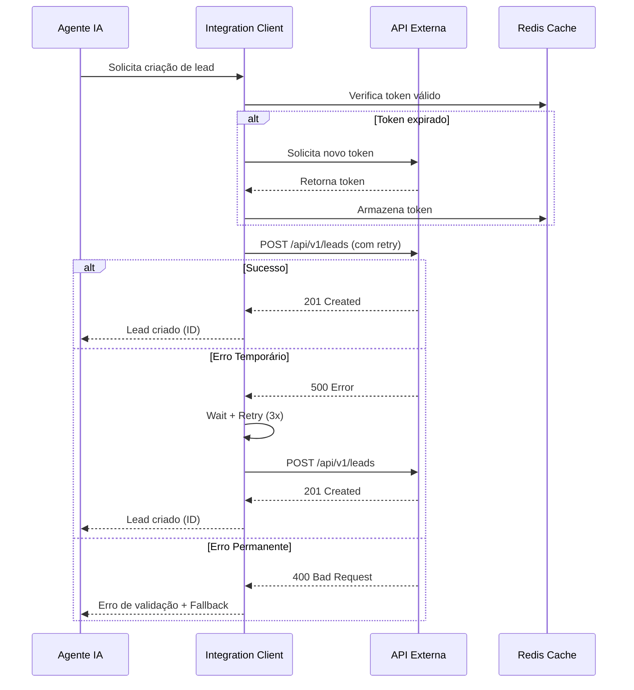

# Especificação de Integração com API

**Sistema:** [NOME DO SISTEMA]
**Versão:** [VERSÃO]
**Responsável:** [NOME]
**Data:** [DATA]
**Última Atualização:** [DATA]

---

## 1. Visão Geral

### 1.1 Objetivo da Integração
[Descrever o objetivo da integração e qual problema resolve]

**Exemplo:**
> Integrar com API do CRM Salesforce para sincronizar leads capturados pelo agente de IA, permitindo que o time comercial acesse os contatos qualificados em tempo real.

### 1.2 Criticidade
- [ ] Crítica (sistema não funciona sem)
- [ ] Alta (funcionalidade importante afetada)
- [ ] Média (funcionalidade secundária)
- [ ] Baixa (nice-to-have)

### 1.3 Tipo de Integração
- [ ] REST API
- [ ] GraphQL
- [ ] SOAP
- [ ] Webhook
- [ ] WebSocket
- [ ] gRPC
- [ ] File-based (CSV, XML, etc)

---

## 2. Informações da API

### 2.1 Endpoint Base
```
Ambiente      | URL
------------- | -------------------------------------------
Sandbox/Dev   | [URL_DESENVOLVIMENTO]
Staging       | [URL_HOMOLOGACAO]
Production    | [URL_PRODUCAO]
```

**Exemplo:**
```
Ambiente      | URL
------------- | -------------------------------------------
Sandbox       | https://test.salesforce.com/services/data/v58.0
Production    | https://login.salesforce.com/services/data/v58.0
```

### 2.2 Documentação
- **Link da documentação oficial:** [URL]
- **Swagger/OpenAPI:** [URL se disponível]
- **Postman Collection:** [URL se disponível]
- **Portal do desenvolvedor:** [URL]

### 2.3 Autenticação

**Tipo de autenticação:**
- [ ] API Key (Header)
- [ ] API Key (Query Parameter)
- [ ] Bearer Token (OAuth 2.0)
- [ ] Basic Authentication
- [ ] JWT
- [ ] Custom Authentication
- [ ] Nenhuma (público)

**Detalhes:**
```yaml
Tipo: [TIPO]
Header/Parameter: [NOME]
Formato: [FORMATO]
Renovação: [AUTOMÁTICA/MANUAL]
Validade: [TEMPO]
```

**Exemplo OAuth 2.0:**
```yaml
Tipo: OAuth 2.0 (Client Credentials)
Token Endpoint: https://login.salesforce.com/services/oauth2/token
Client ID: [VARIÁVEL DE AMBIENTE: CRM_CLIENT_ID]
Client Secret: [VARIÁVEL DE AMBIENTE: CRM_CLIENT_SECRET]
Scope: api, refresh_token
Token Expiry: 2 horas
Refresh Strategy: Automático (30min antes da expiração)
```

### 2.4 Rate Limits
```
Limite         | Valor
-------------- | -------------
Por segundo    | [NÚMERO]
Por minuto     | [NÚMERO]
Por hora       | [NÚMERO]
Por dia        | [NÚMERO]
Concurrent     | [NÚMERO]
```

**Comportamento ao exceder:**
- [ ] HTTP 429 com Retry-After header
- [ ] HTTP 403
- [ ] Bloqueio temporário
- [ ] Outro: [DESCREVER]

**Estratégia de retry:** [DESCREVER COMO TRATAR RATE LIMIT]

---

## 3. Endpoints Utilizados

### 3.1 [Nome do Endpoint 1]

#### Propósito
[Descrever o que este endpoint faz]

#### Método e Path
```http
POST /api/v1/leads
```

#### Headers
```http
Authorization: Bearer {token}
Content-Type: application/json
X-API-Version: 1.0
```

#### Request Body
```json
{
  "nome": "string (required, max 100)",
  "email": "string (required, email format)",
  "telefone": "string (optional, format: +55XX999999999)",
  "empresa": "string (optional, max 200)",
  "cargo": "string (optional)",
  "interesse": "string (required, enum: produto_a, produto_b, servico_x)",
  "origem": "string (required, default: agente_ia)",
  "observacoes": "string (optional, max 1000)",
  "tags": ["string"] (optional, max 10 items)
}
```

#### Response Success (200/201)
```json
{
  "id": "550e8400-e29b-41d4-a716-446655440000",
  "status": "created",
  "lead_id": "LEAD-2024-001",
  "created_at": "2024-01-15T14:30:00Z",
  "message": "Lead criado com sucesso"
}
```

#### Response Error (4xx/5xx)
```json
{
  "error": {
    "code": "VALIDATION_ERROR",
    "message": "Email inválido",
    "details": [
      {
        "field": "email",
        "issue": "formato inválido"
      }
    ]
  }
}
```

#### Códigos de Status
| Código | Significado | Ação |
|--------|-------------|------|
| 200 | Sucesso | Processar response |
| 201 | Criado | Processar response |
| 400 | Validação | Log + Notificar usuário |
| 401 | Não autorizado | Renovar token + Retry |
| 403 | Sem permissão | Log + Alertar equipe |
| 404 | Não encontrado | Log + Fallback |
| 429 | Rate limit | Wait + Retry (exponential backoff) |
| 500 | Erro servidor | Retry (max 3x) + Fallback |
| 503 | Indisponível | Retry (max 5x) + Fallback |

#### Retry Strategy
```yaml
Max Retries: 3
Backoff: Exponential (1s, 2s, 4s)
Retry on: [500, 502, 503, 504, 429]
Timeout: 30s
```

#### Exemplo de Chamada (cURL)
```bash
curl -X POST https://api.example.com/api/v1/leads \
  -H "Authorization: Bearer eyJhbGc..." \
  -H "Content-Type: application/json" \
  -d '{
    "nome": "João Silva",
    "email": "joao@empresa.com",
    "telefone": "+5511999999999",
    "empresa": "Empresa XPTO",
    "interesse": "produto_a",
    "origem": "agente_ia"
  }'
```

---

### 3.2 [Nome do Endpoint 2]

[Repetir estrutura acima para cada endpoint utilizado]

---

## 4. Fluxo de Integração

### 4.1 Diagrama de Sequência



### 4.2 Fluxo Passo a Passo

1. **Preparação**
   - Validar dados de entrada
   - Verificar token de autenticação no cache
   - Renovar token se expirado

2. **Chamada da API**
   - Montar request com headers e body
   - Definir timeout (30s)
   - Executar chamada HTTP

3. **Tratamento de Resposta**
   - **Sucesso (2xx):** Retornar dados + Log de sucesso
   - **Erro Cliente (4xx):** Log + Retornar erro + Não retry
   - **Erro Servidor (5xx):** Log + Retry com backoff exponencial

4. **Fallback**
   - Se todas tentativas falharem:
     - Armazenar request em fila de retry (PostgreSQL)
     - Retornar resposta default ao usuário
     - Alertar equipe técnica

5. **Pós-processamento**
   - Registrar métricas (latência, sucesso/erro)
   - Atualizar cache se necessário
   - Executar webhooks/callbacks se configurados

---

## 5. Tratamento de Erros

### 5.1 Estratégia por Tipo de Erro

| Erro | Estratégia | Retry? | Fallback |
|------|------------|--------|----------|
| Network timeout | Retry exponencial | Sim (3x) | Fila de retry |
| 400 Bad Request | Log + Validação | Não | Resposta erro ao usuário |
| 401 Unauthorized | Renovar token | Sim (1x) | Alertar equipe |
| 404 Not Found | Log | Não | Resposta default |
| 429 Rate Limit | Wait (Retry-After) | Sim (5x) | Fila de retry |
| 500 Server Error | Retry exponencial | Sim (3x) | Fila de retry |
| 503 Service Unavailable | Retry linear | Sim (5x) | Fila de retry + Circuit breaker |

### 5.2 Circuit Breaker

Implementar circuit breaker para evitar sobrecarregar API com falhas:

```yaml
Failure Threshold: 50% (em janela de 1 min)
Open Duration: 30 segundos
Half-Open Requests: 3
Recovery Threshold: 70% sucesso
```

**Estados:**
- **Closed:** Funcionamento normal
- **Open:** Bloqueia chamadas, retorna fallback imediatamente
- **Half-Open:** Permite chamadas de teste para verificar recuperação

### 5.3 Fallback Strategy

**Opções de fallback:**
1. Retornar dados do cache (se aplicável)
2. Retornar resposta default/mock
3. Armazenar em fila para processamento posterior
4. Notificar usuário sobre indisponibilidade

**Exemplo:**
```python
def fallback_create_lead(lead_data):
    """Fallback quando API está indisponível"""
    # Armazenar em fila de retry
    retry_queue.add({
        'action': 'create_lead',
        'data': lead_data,
        'timestamp': datetime.now(),
        'retry_count': 0
    })

    # Retornar resposta ao usuário
    return {
        'status': 'queued',
        'message': 'Seus dados foram registrados e serão processados em breve',
        'id': generate_temp_id()
    }
```

---

## 6. Cache Strategy

### 6.1 O que cachear?

- [ ] Tokens de autenticação
- [ ] Respostas de leitura (GET)
- [ ] Dados de referência (listas, catálogos)
- [ ] Resultados de buscas comuns
- [ ] Nenhum caching necessário

### 6.2 Configuração

```yaml
Cache Backend: Redis
TTL Default: 300s (5 minutos)
Cache Keys Pattern: api:{service}:{resource}:{id}
Invalidation: TTL-based + Manual on updates
Max Size: 1000 entradas
```

**Exemplo:**
```
Token: api:crm:token -> TTL 7200s (2h)
Lead Details: api:crm:lead:12345 -> TTL 300s
Product List: api:erp:products:all -> TTL 3600s (1h)
```

---

## 7. Monitoramento e Observabilidade

### 7.1 Métricas

**Métricas técnicas:**
- Request rate (req/s)
- Response time (p50, p95, p99)
- Error rate (%)
- Timeout rate (%)
- Retry rate (%)

**Métricas de negócio:**
- Leads criados com sucesso
- Taxa de conversão da integração
- Volume por tipo de operação

### 7.2 Logs

**O que logar:**
- Todas as chamadas (request + response)
- Erros e exceções
- Retries e fallbacks
- Renovações de token
- Violações de rate limit

**Formato:**
```json
{
  "timestamp": "2024-01-15T14:30:00Z",
  "level": "info",
  "service": "crm_integration",
  "action": "create_lead",
  "request_id": "req-123",
  "method": "POST",
  "endpoint": "/api/v1/leads",
  "status_code": 201,
  "response_time_ms": 245,
  "retry_count": 0,
  "user_id": "agent-001"
}
```

### 7.3 Alertas

| Alerta | Condição | Severidade | Ação |
|--------|----------|------------|------|
| High Error Rate | > 5% em 5min | P1 | Investigar imediatamente |
| Slow Response | p95 > 5s por 10min | P2 | Verificar performance |
| Rate Limit Hit | Qualquer ocorrência | P2 | Ajustar rate limiting |
| Auth Failure | > 3 falhas consecutivas | P1 | Verificar credenciais |
| Circuit Breaker Open | Estado open | P0 | Verificar disponibilidade API |

---

## 8. Segurança

### 8.1 Dados Sensíveis

**Não enviar para logs:**
- API Keys
- Tokens de acesso
- Senhas
- Dados pessoais sensíveis (CPF, cartão)
- Informações financeiras

**Redaction:**
```python
# Exemplo de redação em logs
{
  "email": "j***@empresa.com",
  "telefone": "+55119999****",
  "token": "eyJ***...***xyz"
}
```

### 8.2 Credenciais

**Armazenamento:**
- [ ] Variáveis de ambiente (.env)
- [ ] Secret Manager (AWS Secrets, GCP Secret Manager)
- [ ] Vault (HashiCorp Vault)
- [ ] Encrypted config file

**Rotação:**
- Frequência: [PERÍODO]
- Processo: [AUTOMÁTICO/MANUAL]
- Responsável: [EQUIPE]

### 8.3 Comunicação

- [ ] HTTPS obrigatório
- [ ] TLS 1.2 ou superior
- [ ] Validação de certificado
- [ ] Timeout configurado (evitar hang)

---

## 9. Testes

### 9.1 Casos de Teste

#### Teste 1: Criação de Lead com Sucesso
```yaml
Given: Dados válidos de lead
When: Chamar POST /api/v1/leads
Then:
  - Status 201
  - Response contém ID
  - Lead criado no CRM
```

#### Teste 2: Erro de Validação
```yaml
Given: Email inválido
When: Chamar POST /api/v1/leads
Then:
  - Status 400
  - Response contém detalhes do erro
  - Nenhum retry executado
```

#### Teste 3: Rate Limit
```yaml
Given: 100 requests em 10s (acima do limite)
When: Chamar POST /api/v1/leads
Then:
  - Status 429 no request 51
  - Retry após Retry-After header
  - Sucesso após retry
```

#### Teste 4: API Indisponível
```yaml
Given: API retornando 503
When: Chamar POST /api/v1/leads
Then:
  - Retry 3x com backoff exponencial
  - Ativar fallback (fila)
  - Retornar resposta ao usuário
```

#### Teste 5: Token Expirado
```yaml
Given: Token expirado no cache
When: Chamar qualquer endpoint
Then:
  - Detectar expiração
  - Renovar token automaticamente
  - Executar request com novo token
```

### 9.2 Mock Data

```json
// mock_success.json
{
  "id": "mock-123",
  "status": "created",
  "lead_id": "LEAD-MOCK-001"
}

// mock_error.json
{
  "error": {
    "code": "VALIDATION_ERROR",
    "message": "Email inválido"
  }
}
```

---

## 10. Dependências

### 10.1 Bibliotecas
```
httpx>=0.26.0          # HTTP client assíncrono
tenacity>=8.2.0        # Retry logic
pydantic>=2.5.0        # Validação de dados
redis>=5.0.0           # Caching
prometheus-client      # Métricas
```

### 10.2 Configuração

Variáveis de ambiente necessárias:
```bash
# API Configuration
CRM_API_URL=https://api.crm.com
CRM_API_KEY=your-key
CRM_TIMEOUT=30
CRM_MAX_RETRIES=3

# Cache
REDIS_HOST=localhost
REDIS_PORT=6379

# Monitoring
ENABLE_METRICS=true
```

---

## 11. Rollout Plan

### 11.1 Fases

**Fase 1: Development (Semana 1)**
- Implementar client básico
- Testes unitários
- Testes de integração com sandbox

**Fase 2: Staging (Semana 2)**
- Deploy em staging
- Testes end-to-end
- Validação com dados reais (não produção)

**Fase 3: Production (Semana 3)**
- Feature flag ativada para 10% do tráfego
- Monitoramento intensivo
- Aumentar para 50% após 48h
- Rollout completo após validação

### 11.2 Rollback Plan

**Critérios para rollback:**
- Error rate > 5%
- Response time p95 > 10s
- Falhas críticas de integração

**Processo:**
1. Desativar feature flag
2. Ativar fallback mode
3. Investigar logs
4. Fix + redeploy

---

## 12. Contatos e Suporte

| Papel | Nome | Contato |
|-------|------|---------|
| Product Owner | [NOME] | [EMAIL] |
| Tech Lead | [NOME] | [EMAIL] |
| API Provider Contact | [NOME] | [EMAIL/SUPORTE] |
| On-call Engineer | [ROTAÇÃO] | [CANAL SLACK/PAGERDUTY] |

**Documentação de Suporte:**
- Portal: [URL]
- SLA: [DESCRIÇÃO]
- Horário de suporte: [HORÁRIO]

---

## 13. Checklist de Implementação

Antes de considerar a integração completa:

- [ ] Client implementado com retry logic
- [ ] Autenticação funcionando (incluindo renovação)
- [ ] Rate limiting respeitado
- [ ] Circuit breaker implementado
- [ ] Cache configurado
- [ ] Fallback strategy implementada
- [ ] Testes unitários (>80% coverage)
- [ ] Testes de integração (casos críticos)
- [ ] Logs estruturados implementados
- [ ] Métricas sendo coletadas
- [ ] Alertas configurados
- [ ] Documentação atualizada
- [ ] Variáveis de ambiente documentadas
- [ ] Testes em sandbox/staging aprovados
- [ ] Rollout plan definido
- [ ] Rollback plan definido
- [ ] Equipe treinada
- [ ] Runbook de operação criado

---

## 14. Changelog

| Versão | Data | Autor | Mudanças |
|--------|------|-------|----------|
| 1.0 | [DATA] | [NOME] | Versão inicial |
| | | | |

---

**Notas Adicionais:**

[Qualquer informação adicional relevante para esta integração]
